# Meridian — Attractor Pipeline Spec

## 1. Overview

Meridian is a web-based daily task organizer with a Python/FastAPI backend designed to also serve a future iOS app. Users create an account, log in, and each day go through a focused planning session where they prioritize tasks. The app sends smart notifications — morning briefing, midday nudges, evening reflection — and over time learns user patterns to help them plan smarter.

This document defines the Attractor pipeline graph for building Meridian: the phases, node types, edge conditions, and convergence criteria. The pipeline is executed by Claude Code pointed at a local Qwen3-Coder instance, which also serves as Meridian's runtime LLM.

## 2. LLM Infrastructure

A single llama.cpp instance serves all purposes — both the coding agent building Meridian and the runtime intelligence features inside it:

```
Model:        Qwen3-Coder (UD-Q8_K_XL quantization)
Server:       llama.cpp
Endpoint:     http://localhost:8085/v1/chat/completions
Context:      262,144 tokens
GPU:          Dual RTX PRO 6000 (45/55 split)
Port:         8085
```

No cloud APIs. No API keys. All computation is local.

**Resource contention:** The coding agent and the running app share this server. See Section 9 for how the pipeline avoids conflicts.

## 3. Tech Stack

| Layer | Technology |
|---|---|
| Backend | Python 3.12+, FastAPI, Pydantic v2, SQLAlchemy 2.0 (async), Alembic |
| Database | PostgreSQL 16 |
| Cache/Queue | Redis 7 (sessions, Celery broker) |
| Task Queue | Celery 5 with Redis broker and result backend |
| Web Frontend | React 18, TypeScript, TanStack Query, Tailwind CSS, dnd-kit |
| Auth | JWT access/refresh tokens, bcrypt, Google OAuth 2.0 |
| Notifications | Web Push (VAPID), email (SMTP via Celery), future APNs |
| LLM (build + runtime) | Qwen3-Coder via llama.cpp at localhost:8085 |
| Testing | pytest + pytest-asyncio (backend), Vitest + Testing Library (frontend) |

## 4. Data Models

### 4.1 `users`

```
id              UUID PRIMARY KEY DEFAULT gen_random_uuid()
email           VARCHAR(255) UNIQUE NOT NULL
password_hash   VARCHAR(255)           -- NULL for OAuth-only users
display_name    VARCHAR(100) NOT NULL
google_id       VARCHAR(255) UNIQUE    -- NULL for email/password users
avatar_url      TEXT
timezone        VARCHAR(50) NOT NULL DEFAULT 'UTC'
created_at      TIMESTAMPTZ NOT NULL DEFAULT now()
updated_at      TIMESTAMPTZ NOT NULL DEFAULT now()
```

### 4.2 `tasks`

```
id              UUID PRIMARY KEY DEFAULT gen_random_uuid()
user_id         UUID NOT NULL REFERENCES users(id) ON DELETE CASCADE
title           VARCHAR(500) NOT NULL
description     TEXT
due_date        DATE
priority        SMALLINT NOT NULL DEFAULT 2  -- 1=low, 2=medium, 3=high, 4=urgent
estimated_minutes INTEGER
energy_level    SMALLINT  -- 1=low, 2=medium, 3=high
category        VARCHAR(100)
status          VARCHAR(20) NOT NULL DEFAULT 'pending'  -- pending, in_progress, completed, cancelled
recurring_rule  JSONB  -- iCal RRULE or null
created_at      TIMESTAMPTZ NOT NULL DEFAULT now()
updated_at      TIMESTAMPTZ NOT NULL DEFAULT now()
completed_at    TIMESTAMPTZ
```

### 4.3 `daily_plans`

```
id              UUID PRIMARY KEY DEFAULT gen_random_uuid()
user_id         UUID NOT NULL REFERENCES users(id) ON DELETE CASCADE
plan_date       DATE NOT NULL
task_order      UUID[] NOT NULL  -- ordered array of task IDs
notes           TEXT
mood            SMALLINT  -- 1-5 scale, set during evening reflection
created_at      TIMESTAMPTZ NOT NULL DEFAULT now()
updated_at      TIMESTAMPTZ NOT NULL DEFAULT now()

UNIQUE(user_id, plan_date)
```

### 4.4 `task_completions`

```
id              UUID PRIMARY KEY DEFAULT gen_random_uuid()
task_id         UUID NOT NULL REFERENCES tasks(id) ON DELETE CASCADE
daily_plan_id   UUID NOT NULL REFERENCES daily_plans(id) ON DELETE CASCADE
planned_position SMALLINT NOT NULL  -- position in the day's plan
actual_completed BOOLEAN NOT NULL DEFAULT false
actual_minutes   INTEGER  -- how long it actually took
completed_at     TIMESTAMPTZ
skipped_reason   VARCHAR(255)
```

### 4.5 `notification_preferences`

```
id              UUID PRIMARY KEY DEFAULT gen_random_uuid()
user_id         UUID UNIQUE NOT NULL REFERENCES users(id) ON DELETE CASCADE
morning_briefing_enabled  BOOLEAN NOT NULL DEFAULT true
morning_briefing_time     TIME NOT NULL DEFAULT '08:00'
midday_nudge_enabled      BOOLEAN NOT NULL DEFAULT true
midday_nudge_time         TIME NOT NULL DEFAULT '12:00'
evening_reflection_enabled BOOLEAN NOT NULL DEFAULT true
evening_reflection_time    TIME NOT NULL DEFAULT '20:00'
email_notifications       BOOLEAN NOT NULL DEFAULT true
push_notifications        BOOLEAN NOT NULL DEFAULT true
quiet_hours_start         TIME
quiet_hours_end           TIME
```

### 4.6 `push_subscriptions`

```
id              UUID PRIMARY KEY DEFAULT gen_random_uuid()
user_id         UUID NOT NULL REFERENCES users(id) ON DELETE CASCADE
endpoint        TEXT NOT NULL
p256dh_key      TEXT NOT NULL
auth_key        TEXT NOT NULL
user_agent      TEXT
created_at      TIMESTAMPTZ NOT NULL DEFAULT now()
```

### 4.7 `user_patterns` (Intelligence Layer)

```
id              UUID PRIMARY KEY DEFAULT gen_random_uuid()
user_id         UUID NOT NULL REFERENCES users(id) ON DELETE CASCADE
pattern_type    VARCHAR(50) NOT NULL  -- 'peak_hours', 'category_preference', 'completion_rate', 'estimation_accuracy'
pattern_data    JSONB NOT NULL
confidence      FLOAT NOT NULL DEFAULT 0.0  -- 0.0 to 1.0
computed_at     TIMESTAMPTZ NOT NULL DEFAULT now()
```

## 5. Pipeline Graph

Node shapes follow Attractor conventions:

- `Mdiamond` — pipeline entry point
- `Msquare` — pipeline exit point
- `box` (default) — codergen node (LLM-driven code generation)
- `hexagon` — human-in-the-loop approval gate

```dot
digraph Meridian {
  graph [
    goal = "Build Meridian: a daily task organizer with FastAPI backend, React frontend, smart notifications, and an intelligence layer",
    default_max_retry = 3,
    retry_target = "implement_current_phase",
    model_stylesheet = "
      * {
        llm_provider: openai_compatible;
        llm_base_url: http://localhost:8085/v1;
        llm_model: qwen3-coder;
      }
    "
  ]

  // ---- Entry / Exit ----
  start [shape=Mdiamond]
  exit  [shape=Msquare]

  // ---- Phase 0: Project Scaffold ----
  scaffold [
    label = "Scaffold Project",
    prompt = "Create the monorepo structure: /backend (FastAPI with pyproject.toml, alembic.ini, app/ with routers/, models/, schemas/, services/, core/ directories), /frontend (React+Vite+TypeScript with src/components, src/hooks, src/api, src/pages), docker-compose.yml with PostgreSQL 16, Redis 7, and Celery worker services. Include .env.example, README.md, and CI config. Set up pytest and Vitest test scaffolds."
  ]

  // ---- Phase 1: Database & Auth ----
  schema_design [
    label = "Design Schema",
    prompt = "Create Alembic migrations implementing all data models from the spec: users, tasks, daily_plans, task_completions, notification_preferences, push_subscriptions, user_patterns. Add appropriate indexes (user_id on all tables, plan_date on daily_plans, due_date+status on tasks). Use PostgreSQL-native UUID generation."
  ]

  schema_gate [
    shape = hexagon,
    label = "Review Schema",
    prompt = "Present the schema design for human review. Show the ER diagram, all indexes, foreign key relationships, and migration files. Ask: approve schema, request changes, or reject and redesign."
  ]

  implement_auth [
    label = "Implement Auth",
    prompt = "Implement user authentication: (1) POST /auth/register with email+password, bcrypt hashing, email validation. (2) POST /auth/login returning JWT access (15min) + refresh (7day) tokens. (3) POST /auth/refresh for token renewal. (4) GET /auth/google and GET /auth/google/callback for Google OAuth 2.0 flow. (5) GET /users/me for current user profile. (6) Middleware extracting user from Authorization: Bearer header. (7) Redis-backed session store for refresh token revocation. Write comprehensive pytest tests."
  ]

  test_auth [
    label = "Test Auth",
    prompt = "Run the full auth test suite. Verify all tests pass. If any fail, analyze the failures, fix the code, and re-run until green.",
    goal_gate = true
  ]

  // ---- Phase 2: Task CRUD ----
  implement_tasks [
    label = "Implement Tasks",
    prompt = "Implement task management: (1) POST /tasks. (2) GET /tasks with filters, cursor-based pagination, search. (3) GET /tasks/{id} (404 not 403 for other users). (4) PATCH /tasks/{id}. (5) DELETE /tasks/{id} (soft-delete). (6) POST /tasks/{id}/complete. All require auth. Pydantic v2 schemas. Write tests for CRUD, authorization, filtering, pagination, edge cases."
  ]

  test_tasks [
    label = "Test Tasks",
    prompt = "Run the task management test suite. All tests must pass.",
    goal_gate = true
  ]

  // ---- Phase 3: Daily Planning ----
  implement_planning [
    label = "Implement Planning",
    prompt = "Implement daily planning: (1) POST /plans/{date} — create/update plan with ordered task IDs. (2) GET /plans/{date}. (3) GET /plans (last 30 days). (4) PATCH /plans/{date}/reorder. (5) POST /plans/{date}/complete — end-of-day completion data. (6) GET /plans/{date}/reflection — completion stats. Write tests for all operations including timezone-aware date boundaries."
  ]

  implement_planning_frontend [
    label = "Implement Planning UI",
    prompt = "Build the React frontend: Login/Register pages, Dashboard with drag-and-drop (dnd-kit), Task creation/edit modal, Task list with filters, Daily plan view, Evening reflection modal, API client with TanStack Query + JWT interceptor + auto token refresh. Tailwind CSS, responsive."
  ]

  test_planning [
    label = "Test Planning",
    prompt = "Run backend planning tests and frontend component tests. All must pass.",
    goal_gate = true
  ]

  planning_gate [
    shape = hexagon,
    label = "Review Planning UX",
    prompt = "Present the planning flow for human review. Ask: approve, request UX changes, or request backend changes."
  ]

  // ---- Phase 4: Notifications ----
  implement_notifications [
    label = "Implement Notifications",
    prompt = "Implement notifications: (1) Celery beat per-user-timezone scheduling. (2) Morning briefing. (3) Midday nudge if <50% done. (4) Evening reflection prompt. (5) Preference management endpoint. (6) Web Push subscribe endpoint. (7) pywebpush VAPID delivery. (8) Email via SMTP Celery task. (9) Quiet hours. Write tests with mocked time."
  ]

  test_notifications [
    label = "Test Notifications",
    prompt = "Run notification tests. All must pass.",
    goal_gate = true
  ]

  // ---- Phase 5: Intelligence Layer ----
  implement_intelligence [
    label = "Implement Intelligence",
    prompt = "Implement intelligence layer. LLM is local llama.cpp at http://localhost:8085 (OpenAI-compatible API). (1) Nightly pattern detection Celery job: peak hours, category preferences, completion trends, estimation accuracy → user_patterns with confidence scores. (2) GET /intelligence/suggestions — task ordering with reasoning and warnings, LLM-powered with rule-based fallback. (3) POST /tasks/parse — NL task capture via LLM with graceful fallback. (4) GET /intelligence/insights — weekly stats. Tests use a mock LLM client (do NOT call real llama.cpp during tests)."
  ]

  test_intelligence [
    label = "Test Intelligence",
    prompt = "Run intelligence tests with mock LLM client. Pattern detection, NL parsing, and suggestions must work correctly against fixture data.",
    goal_gate = true
  ]

  intelligence_gate [
    shape = hexagon,
    label = "Review Intelligence Design",
    prompt = "Present the intelligence layer: pattern storage, suggestion algorithm, NL parsing prompts, fallback behavior. Ask: approve, adjust patterns, or change weighting."
  ]

  // ---- Phase 6: Integration & Polish ----
  integration [
    label = "Integration & Polish",
    prompt = "Final integration: (1) End-to-end smoke tests. (2) OpenAPI docs with examples. (3) Consistent error format. (4) Rate limiting on auth. (5) CORS config. (6) Health check (DB + Redis + llama.cpp). (7) Frontend error boundaries. (8) Docker compose working end-to-end."
  ]

  test_integration [
    label = "Integration Tests",
    prompt = "Run full test suite. Docker compose up, verify health checks. All goal gates satisfied.",
    goal_gate = true
  ]

  // ---- Edges ----
  start -> scaffold
  scaffold -> schema_design
  schema_design -> schema_gate
  schema_gate -> implement_auth [label="approved"]
  schema_gate -> schema_design [label="changes_requested"]
  implement_auth -> test_auth
  test_auth -> implement_tasks
  implement_tasks -> test_tasks
  test_tasks -> implement_planning
  implement_planning -> implement_planning_frontend
  implement_planning_frontend -> test_planning
  test_planning -> planning_gate
  planning_gate -> implement_notifications [label="approved"]
  planning_gate -> implement_planning [label="backend_changes"]
  planning_gate -> implement_planning_frontend [label="ux_changes"]
  implement_notifications -> test_notifications
  test_notifications -> implement_intelligence
  implement_intelligence -> test_intelligence
  test_intelligence -> intelligence_gate
  intelligence_gate -> integration [label="approved"]
  intelligence_gate -> implement_intelligence [label="changes_requested"]
  integration -> test_integration
  test_integration -> exit
}
```



## 6. Phase Descriptions

### Phase 0: Scaffold
Creates the monorepo, dependency files, Docker setup, and test scaffolds. No human gate.

### Phase 1: Database & Auth
Schema design and authentication. The schema gate pauses for human review before code is written against it.

### Phase 2: Task CRUD
Standard resource management. `goal_gate` ensures all operations work before proceeding.

### Phase 3: Daily Planning
Core feature — backend and frontend. Human gate reviews the UX flow.

### Phase 4: Notifications
Celery-based scheduled jobs with timezone awareness.

### Phase 5: Intelligence Layer
Pattern detection and LLM-powered features. All runtime LLM calls go to localhost:8085. Tests use mock LLM client to avoid contention with the coding agent. Human gate reviews algorithm design.

### Phase 6: Integration
Final assembly. `goal_gate` on `test_integration` is the convergence condition.

## 7. Edge Conditions

- **"approved"** — human selected "approve" at the gate
- **"changes_requested"** — human selected "request changes" with feedback
- **"backend_changes"** / **"ux_changes"** — human specified which layer needs work

Goal gates create implicit retry edges: if the test suite fails, execution returns to `retry_target` and retries up to `default_max_retry` times.

## 8. Convergence Criteria

The pipeline converges when:

1. All `goal_gate` nodes report test suites passing
2. All human gates have been approved
3. Docker compose boots all services and health checks respond
4. The full scenario suite achieves ≥ 0.85 aggregate satisfaction score

## 9. Resource Contention: Coding Agent vs Runtime LLM

The coding agent (Claude Code → localhost:8085) and Meridian's intelligence features (also → localhost:8085) share the same llama.cpp server. The pipeline avoids conflicts:

1. **During coding phases** (codergen nodes): Agent uses the model exclusively. Meridian is not running.
2. **During test phases** (goal_gate nodes): Agent starts Meridian's stack, runs tests, stops the stack. Intelligence layer tests use a **mock LLM client** — they never call the real server.
3. **Integration tests needing real LLM**: Gated behind `LLM_INTEGRATION_TESTS=1`. Run manually after the pipeline completes, when the coding agent is idle.

## 10. Future Phase: iOS App

Designed for but not built:

- All endpoints return JSON compatible with Swift Codable
- Auth uses JWT Bearer tokens, no cookies
- Push notification infrastructure includes an APNs adapter interface (not implemented)
- WebSocket endpoint documented in OpenAPI but not implemented
